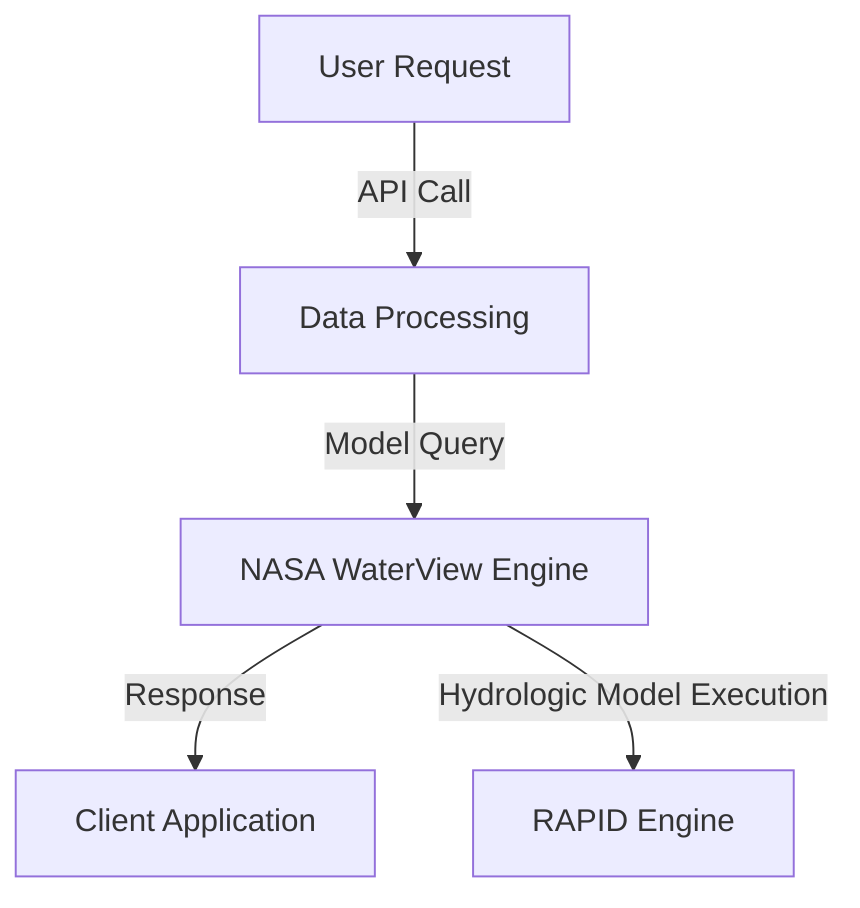

## **API Reference**

### **Core API Endpoints**
- `/data/hydroglobe` - Fetch HydroGlobe data
- `/data/nldas3` - Retrieve NLDAS-3 models
- `/data/riverview` - Get RiverView statistics
- `/visualize/veda` - Integrate with VEDA visualization tools
- `/data/rapid` - Retrieve RAPID simulation results

