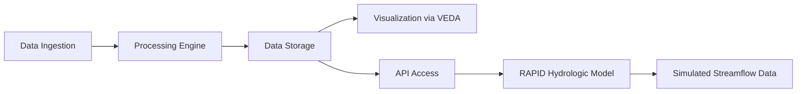

## **Architecture**

```mermaid
graph LR;
  A[Data Ingestion] --> B[Processing Engine]
  B --> C[Data Storage]
  C --> D[Visualization via VEDA]
  C --> E[API Access]
  E --> F[RAPID Hydrologic Model]
  F --> G[Simulated Streamflow Data]
```
